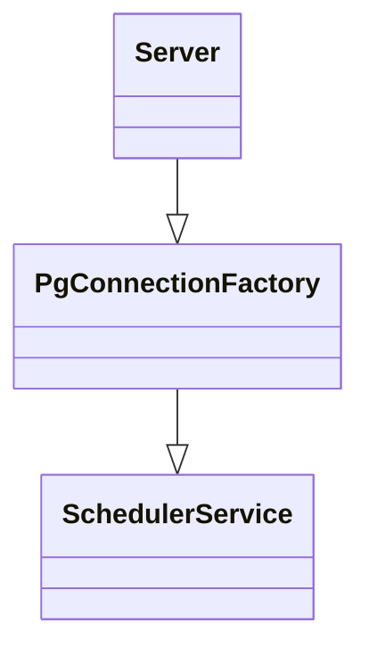

# ChiselEdge Design

This is a design document for ChiselEdge.

## Overview

ChiselEdge is a distributed SQL database that optimizes for fast application-local reads.

## Goals

* Fast application-local reads using eventual consistent read replicas on SQLite
* Unified interface for applications with SQLite
* Easy to integrate with existing apps

## Architecture

ChiselEdge follows a traditional client-server model:

* Client talks to the server using the PostgreSQL wire protocol (that carries SQLite statements)
* Client is either a proxy (that has opportunistic cache) or a replica (copy of the whole database)
* Server processes client requests against a server-side SQLite and sends responses back to the client.
* Server passively replicates database to all clients that can hold a replica.

### Server

The server architecture uses the service design pattern and uses `tower` as an interface. Tower provides middleware that we can reuse, and the design implements a clear separation of concern. Service is isolated and composable, which is a desirable property.

Here is a simplified architecture diagram:

`Server::serve` takes a `Service` (in fact, a Service factory), and calls the passed service with all incoming socket connections. The server runs the connections.

The `PgConnectionFactory` service takes a service factory that responds to `Query` requests and drives the Postgres wire protocol.

The `SchedulerServiceFactory` creates `SchedulerService`s that respond to `Query` requests, and schedule them to be performed.

## Transactions

* Serializable reads and writes
* [Snapshot isolated](https://jepsen.io/consistency/models/snapshot-isolation) reads

The transaction isolation level provided by SQLite is *serializable*, which is the default transaction isolation in ChiselEdge as well. In ChiselEdge, serializable transaction implies a network hop over to the primary server, which means serializable transactions are slow. In particular, SQLite allows a *single* writer at a time, which makes writes very very slow. That said, SQLite does support `BEGIN CONCURRENT`, which should allow at least some write concurrency.

However, ChiselEdge provides *snapshot isolated reads* if there's an application-local replica. The replication itself is eventually consistent, but the reads are *snapshot isolated* because regardless of any ongoing replication, a transaction will use SQLite's transactions to have a consistent view. The read can return stale data, but that's allowed by snapshot isolation.

Marin Postma speculates that if SQLite had MVCC, we could also allow snapshot isolated writes.
