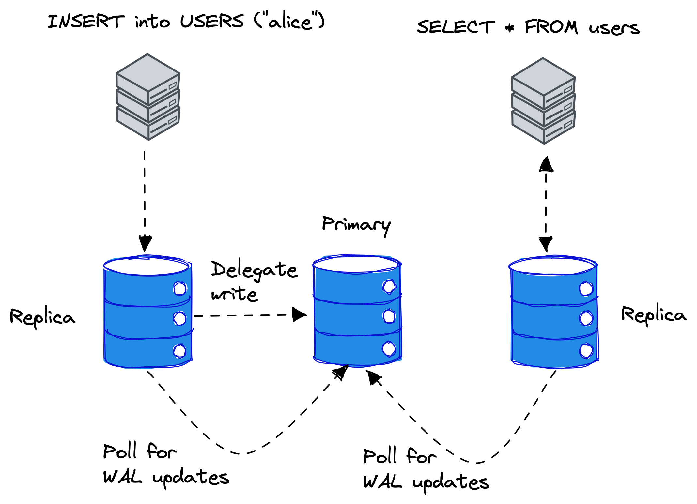

# `sqld` User Guide

Welcome to the `sqld` user guide!

## Table of Contents

* [Overview](#overview)
* [Replication](#replication)
    * [TLS configuration](#tls-configuration)
    * [Launching a primary server](#launching-a-primary-server)
    * [Launching a replica server](#launching-a-replica-server)
* [Client Authentication](#clientauthentication)
* [Deployment](#deployment)
    * [Deploying with Docker](#deploying-with-docker)
    * [Deploying on Fly](#deploying-on-fly)

## Overview

The `sqld` program provides libsql over HTTP and supports transparent replication.


<p align="center">
Figure 1. Overview of libsql clustering.
</p>

Figure 1 shows an overview of libsql cluster where clients execute SQL remotely over HTTP against `sqld` instances.
In the middle, there is the _primary_ instance, which is responsible for accepting writes and servicing replicas for write-ahead log (WAL) updates.
If a client performs a write operation such as `INSERT` statement in SQL, replicas delegate the write to a primary node.
Read operations, such as `SELECT` statements, however, are executed on the replica directly.
The replicas poll the primary instance for WAL updates periodically over a gRPC connection.

## Replication

In this section, we will walk you through how to set up a libsql cluster.

### TLS configuration

The nodes in a `sqld` cluster communicate over gRPC with TLS. To set up a `sqld` cluster, you need the following TLS configuration:

* Certificate authority (CA) certificate and private key
* Primary server certificate and private key
* Replica server certificates and private keys

In TLS speak, the primary server is the server and the replica servers are the clients.

For *development and testing* purposes, you can generate TLS keys and certificates with:

```console
python scripts/gen_certs.py
```

The script generates the following files:

* `ca_cert.pem` -- certificate authority certificate
* `ca_key.pem` -- certificate authority private key
* `server_cert.pem` -- primary server certificate
* `server_key.pem` -- primary server private key
* `client_cert.pem` -- replica server certificate
* `client_key.pem ` -- replica server private key

### Launching a primary server

To start a `sqld` server in primary mode, run:

```console
sqld \
  --http-listen-addr 127.0.0.1:8081 \
  --grpc-listen-addr 127.0.0.1:5001 \
  --grpc-tls \
  --grpc-ca-cert-file ca_cert.pem \
  --grpc-cert-file server_cert.pem \
  --grpc-key-file server_key.pem
```

You now have a `sqld` primary server listening to SQL over HTTP at `127.0.0.1:8081` and gRPC with TLS at `127.0.0.1:5001`.

### Launching a replica server

To start a a `sqld` server in replica mode, run:

```console
sqld \
  --http-listen-addr 127.0.0.1:8082 \
  --primary-grpc-url https://127.0.0.1:5001 \
  --primary-grpc-tls \
  --primary-grpc-ca-cert-file ca_cert.pem \
  --primary-grpc-cert-file client_cert.pem \
  --primary-grpc-key-file client_key.pem
```

You now have a `sqld` replica server listening to SQL over HTTP at `127.0.0.1:8082`, which is connected to a primary server at `127.0.0.1:5001`.

You can add more replicas to the cluster by just starting more `sqld` processes. However, it's recommended that you generate a different TLS configuration for every replica.

To test the cluster, you can, for example, create a table and insert rows in the replica:

```console
curl -d '{"statements": ["CREATE TABLE IF NOT EXISTS users (username)", "INSERT INTO users VALUES (\"alice\")"]}' 127.0.0.1:8082
```

and query the results from the primary:

```console
curl -d '{"statements": ["SELECT * FROM users"]}' 127.0.0.1:8081
```

## Client Authentication

You can configure client authentication by passing the `--auth-jwt-key-file FILENAME` command line option to `sqld`.
The key is either a PKCS#8-encoded Ed25519 public key in PEM, or just plain bytes of the Ed25519 public key in URL-safe base64.

## Deployment

### Deploying with Docker

You can pull the official Docker image for `sqld` with

```console
docker pull ghcr.io/libsql/sqld:main
```

You can find more information about the Docker image [here](./DOCKER.md).

### Deploying on Fly

You can use the existing `fly.toml` file from this repository.

Just run
```console
flyctl launch
```
... then pick a name and respond "Yes" when the prompt asks you to deploy.

You now have `sqld` running on Fly listening for HTTP connections.

Give it a try with this snippet, replacing `$YOUR_APP` with your app name:
```
curl -X POST -d '{"statements": ["create table testme(a,b,c)"]}' $YOUR_APP.fly.dev
curl -X POST -d '{"statements": ["insert into testme values(1,2,3)"]}' $YOUR_APP.fly.dev
curl -X POST -d '{"statements": ["select * from testme"]}' $YOUR_APP.fly.dev
```
```
[{"b":2,"a":1,"c":3}]
```

## Incremental snapshots

The `sqld` generates incremental snapshots of the database file, which you can apply to a local libSQL replica.
For example, suppose you have an application that is not always connected over the network and can't rely on the `sqld` gRPC replication method. In that case, you can configure `sqld` to notify of generated incremental snapshots, sync the snapshot files to another machine, and apply them.

You can use the `--snapshot-exec` command line option to specify a file, such as a shell script, to execute on snapshot generation. You can also use the `--max-log-duration SECS` command line option
on to control how often `sqld` generates the snapshot files to ensure the freshness of the data on local replicas.

To use incremental snapshots, first, create a shell script with the name `snapshot.sh`:

```bash
#!/bin/bash

SNAPSHOT_FILE="$1"
NAMESPACE="$2"

echo "Generated incremental snapshot $SNAPSHOT_FILE for namespace $NAMESPACE"
```

and then configure `sqld` to generate an incremental snapshot every 5 seconds and invoke the shell script when `sqld` generates a snapshot:

```console
sqld --snapshot-exec ./snapshot.sh --max-log-duration 5
```

When you write to the `sqld` database, you will eventually see log line such as:

```console
2023-08-11T08:21:04.183564Z  INFO sqld::replication::snapshot: snapshot `e126f594-90f4-45be-9350-bc8a01160de9-0-2.snap` successfully created
Generated incremental snapshot data.sqld/dbs/default/snapshots/e126f594-90f4-45be-9350-bc8a01160de9-0-2.snap
```

The first line is logging from `sqld` and the second line is `sqld` executing `snapshot.sh` script.
You can now, for example, `rsync` the snapshot file to another machine, to apply the changes to a local replica with the `Database::sync_frames()` method of the `libsql` crate:

```rust
use libsql::Database;
use libsql_replication::{Frames, TempSnapshot};

#[tokio::main]
async fn main() {
    tracing_subscriber::fmt::init();

    let opts = libsql::Opts::with_sync();
    let db = Database::open_with_opts("test.db", opts).await.unwrap();
    let conn = db.connect().unwrap();

    let args = std::env::args().collect::<Vec<String>>();
    if args.len() < 2 {
        println!("Usage: {} <snapshot path>", args[0]);
        return;
    }
    let snapshot_path = args.get(1).unwrap();
    let snapshot = TempSnapshot::from_snapshot_file(snapshot_path.as_ref()).unwrap();

    db.sync_frames(Frames::Snapshot(snapshot)).unwrap();

    let rows = conn
        .query("SELECT * FROM sqlite_master", ())
        .unwrap()
        .unwrap();
    while let Ok(Some(row)) = rows.next() {
        println!(
            "| {:024} | {:024} | {:024} | {:024} |",
            row.get::<&str>(0).unwrap(),
            row.get::<&str>(1).unwrap(),
            row.get::<&str>(2).unwrap(),
            row.get::<&str>(3).unwrap(),
        );
    }
}
```

## Multitenancy

The `sqld` server supports more than one database. To create a database, send a create namespace request to the [admin API](ADMIN_API.md).
For example, to create a database named `db1`, send the following HTTP request:

```shell
curl -X POST http://localhost:8080/v1/namespaces/db1/create
```

The name of the database is determined from the `Host` header in the HTTP request.

For example, if you have the following entries in your `/etc/hosts` file:

```console
127.0.0.1       db1.local
127.0.0.1       db2.local
```

You can access `db1` with the `http://db1.local:8080`URL and `db2` with `http://db2.local:8080`.
The database files for the databases are stored in `<data dir>/dbs/db1` and `<data dir/dbs/db2`, respectively.

### Path based routing

For local development and testing, you can also connect to your databases by specifying the database namespace in the URL path.

You can access namespace `db1` with the `http://local:8080/dev/db1` URL and `db2` with `http://local:8080/dev/db2`, respectively.

### Wildcard domain for development

If you don't feel like editing `/etc/hosts` each time you want to test a new namespace, you can use any domain
that returns `127.0.0.1` for all subdomains. One of such domains is `*.db.sarna.dev`, which you can use to access
your local `db1` and `db2` as `http://db1.db.sarna.dev` and `http://db2.db.sarna.dev` respectively.
