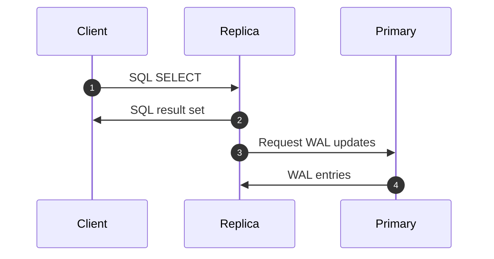
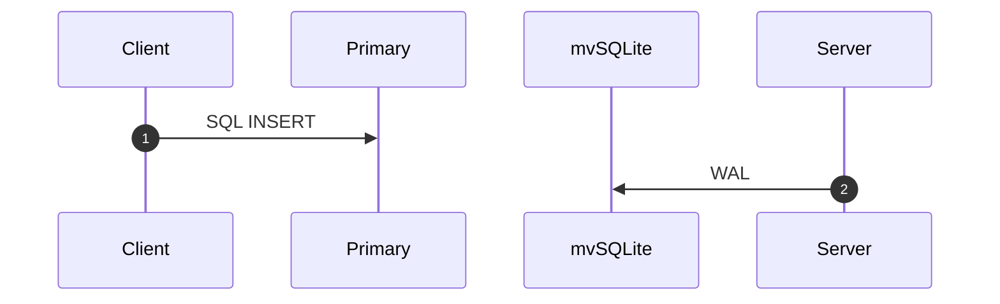
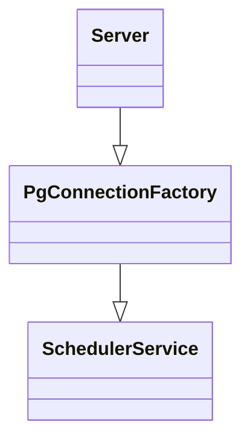

## Overview

`sqld` is a server mode for [libSQL](https://libsql.org), which provides SQLite interface and dialect for use cases such as edge functions where it's impractical to embed a full database engine.

## Logical Architecture

The `sqld` consists of a:

* Client
* Primary server
* Replica servers (optional)
* mvSQLite backend (optional)

The client provides a SQLite ABI compatible inteface as a drop-in replacement for applications using libSQL or SQLite. The client library transforms SQLite C API calls into PostgreSQL wire protocol messages and sends them to the primary server.

The primary server is a `sqld` process, which servers SQLite dialect over the PostgreSQL wire protocol. The server can either be backed by single-node `libSQL` database or by a mvSQLite backend, which provides improved write concurrency, high availability, and fault tolerance using FoundationDB.

Replica servers is a `sqld` process, which only serves reads locally, and delegates writes to the primary server. The server is backed by a `libSQL` database.

Finally, the mvSQLite backend is a FoundationDB cluster, which can be optionally used by the primary server.

### Reads

Clients initiate reads by using the `sqlite3_exec()` API, for example, to perform a `SELECT` query.
The client sends messages over the network to a replica server, which performs the `SELECT` query on its local database, and sends back the results over the network.
The replica also periodically polls the primary server for WAL updates to refresh the database.

### Writes

Clients initialte writes with, for example, the `sqlite3_exec()` API by performing a `INSERT`, `UPDATE`, or `DELETE` SQL statement.
The primary server is responsible for writes.
The client sends writes to the primary server or a replica. If a replica receives a write, it delegates the write to the primary server.
The primary server either performs the write against its local `libSQL` database or processes it via `mvSQLite`, which uses FoundationDB.

## Server

The server architecture uses the service design pattern and uses `tower` as an interface. Tower provides middleware that we can reuse, and the design implements a clear separation of concern. Service is isolated and composable, which is a desirable property.

Here is a simplified architecture diagram:

`Server::serve` takes a `Service` (in fact, a Service factory), and calls the passed service with all incoming socket connections. The server runs the connections.

The `PgConnectionFactory` service takes a service factory that responds to `Query` requests and drives the Postgres wire protocol.

The `SchedulerServiceFactory` creates `SchedulerService`s that respond to `Query` requests, and schedule them to be performed.
