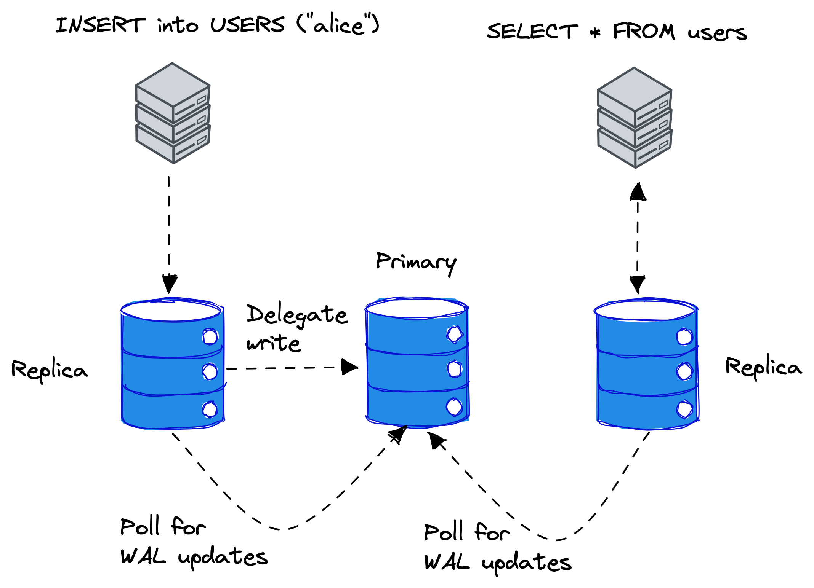

# `sqld` User Guide

Welcome to the `sqld` user guide!

## Table of Contents

* [Overview](#overview)
* [Replication](#replication)
    * [TLS configuration](#tls-configuration)
    * [Launching a primary server](#launching-a-primary-server)
    * [Launching a replica server](#launching-a-replica-server)
* [Client Authentication](#clientauthentication)
* [Deployment](#deployment)
    * [Deploying with Docker](#deploying-with-docker)
    * [Deploying on Fly](#deploying-on-fly)

## Overview

The `sqld` program provides libsql over HTTP and supports transparent replication.


<p align="center">
Figure 1. Overview of libsql clustering.
</p>

Figure 1 shows an overview of libsql cluster where clients execute SQL remotely over HTTP against `sqld` instances.
In the middle, there is the _primary_ instance, which is responsible for accepting writes and servicing replicas for write-ahead log (WAL) updates.
If a client performs a write operation such as `INSERT` statement in SQL, replicas delegate the write to a primary node.
Read operations, such as `SELECT` statements, however, are executed on the replica directly.
The replicas poll the primary instance for WAL updates periodically over a gRPC connection.

## Replication

In this section, we will walk you through how to set up a libsql cluster.

### TLS configuration

The nodes in a `sqld` cluster communicate over gRPC with TLS. To set up a `sqld` cluster, you need the following TLS configuration:

* Certificate authority (CA) certificate and private key
* Primary server certificate and private key
* Replica server certificates and private keys

In TLS speak, the primary server is the server and the replica servers are the clients.

For *development and testing* purposes, you can generate TLS keys and certificates with:

```console
python scripts/gen_certs.py
```

The script generates the following files:

* `ca_cert.pem` -- certificate authority certificate
* `ca_key.pem` -- certificate authority private key
* `server_cert.pem` -- primary server certificate
* `server_key.pem` -- primary server private key
* `client_cert.pem` -- replica server certificate
* `client_key.pem ` -- replica server private key

### Launching a primary server

To start a `sqld` server in primary mode, run:

```console
sqld \
  --http-listen-addr 127.0.0.1:8081 \
  --grpc-listen-addr 127.0.0.1:5001 \
  --grpc-tls \
  --grpc-ca-cert-file ca_cert.pem \
  --grpc-cert-file server_cert.pem \
  --grpc-key-file server_key.pem
```

You now have a `sqld` primary server listening to SQL over HTTP at `127.0.0.1:8081` and gRPC with TLS at `127.0.0.1:5001`.

### Launching a replica server

To start a a `sqld` server in replica mode, run:

```console
sqld \
  --http-listen-addr 127.0.0.1:8082 \
  --primary-grpc-url https://127.0.0.1:5001 \
  --primary-grpc-tls \
  --primary-grpc-ca-cert-file ca_cert.pem \
  --primary-grpc-cert-file client_cert.pem \
  --primary-grpc-key-file client_key.pem
```

You now have a `sqld` replica server listening to SQL over HTTP at `127.0.0.1:8082`, which is connected to a primary server at `127.0.0.1:5001`.

You can add more replicas to the cluster by just starting more `sqld` processes. However, it's recommended that you generate a different TLS configuration for every replica.

To test the cluster, you can, for example, create a table and insert rows in the replica:

```console
curl -d '{"statements": ["CREATE TABLE IF NOT EXISTS users (username)", "INSERT INTO users VALUES (\"alice\")"]}' 127.0.0.1:8082
```

and query the results from the primary:

```console
curl -d '{"statements": ["SELECT * FROM users"]}' 127.0.0.1:8081
```

## Client Authentication

You can configure client authentication by passing the `--auth-jwt-key-file FILENAME` command line option to `sqld`.
The key is either a PKCS#8-encoded Ed25519 public key in PEM, or just plain bytes of the Ed25519 public key in URL-safe base64.

## Deployment

### Deploying with Docker

You can pull the official Docker image for `sqld` with

```console
docker pull ghcr.io/libsql/sqld:main
```

You can find more information about the Docker image [here](./DOCKER.md).

### Deploying on Fly

You can use the existing `fly.toml` file from this repository.

Just run
```console
flyctl launch
```
... then pick a name and respond "Yes" when the prompt asks you to deploy.

You now have `sqld` running on Fly listening for HTTP connections.

Give it a try with this snippet, replacing `$YOUR_APP` with your app name:
```
curl -X POST -d '{"statements": ["create table testme(a,b,c)"]}' $YOUR_APP.fly.dev
curl -X POST -d '{"statements": ["insert into testme values(1,2,3)"]}' $YOUR_APP.fly.dev
curl -X POST -d '{"statements": ["select * from testme"]}' $YOUR_APP.fly.dev
```
```
[{"b":2,"a":1,"c":3}]
```
